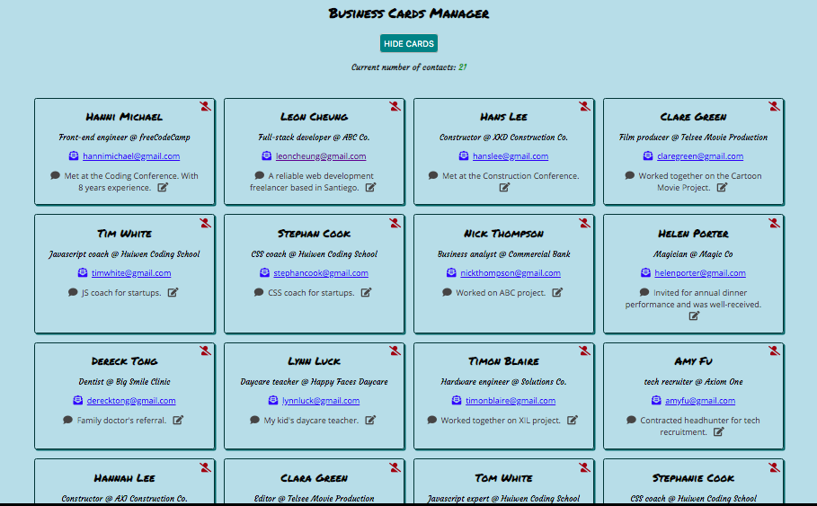

# Order Burger Online
This project is to practice React with multiple layers of components, using props. 

[](screenshot)
[](screenshot)

## Library used

- React

## How to run: 
```
npm install 
npm start
```